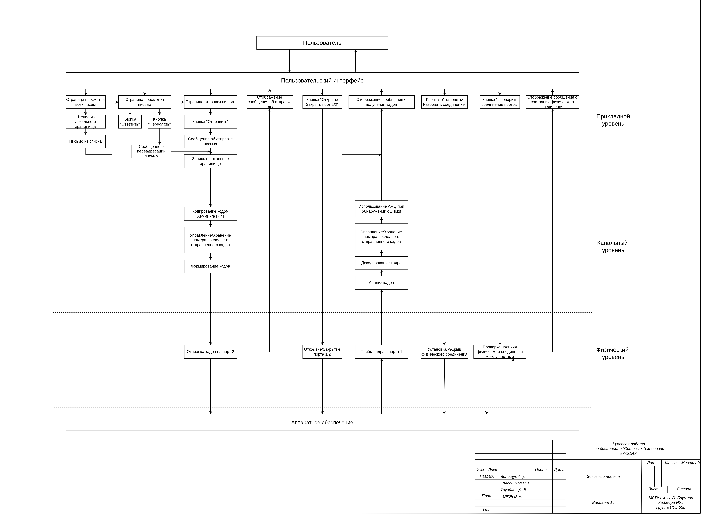
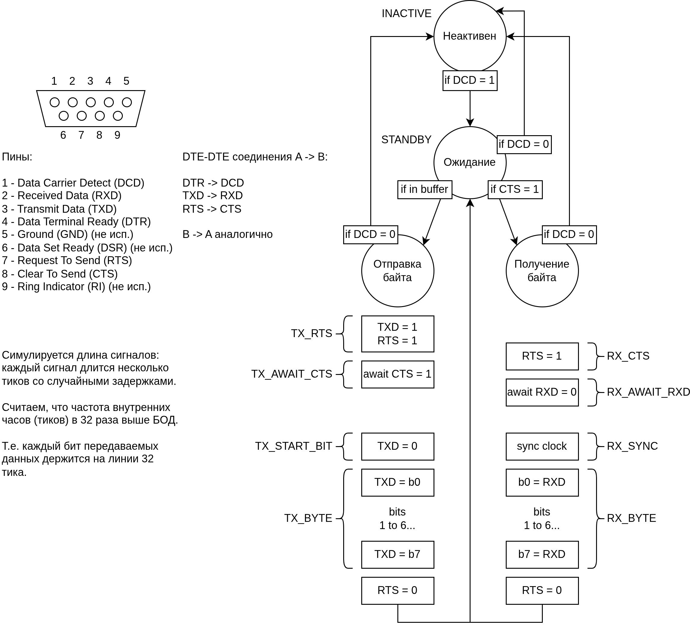
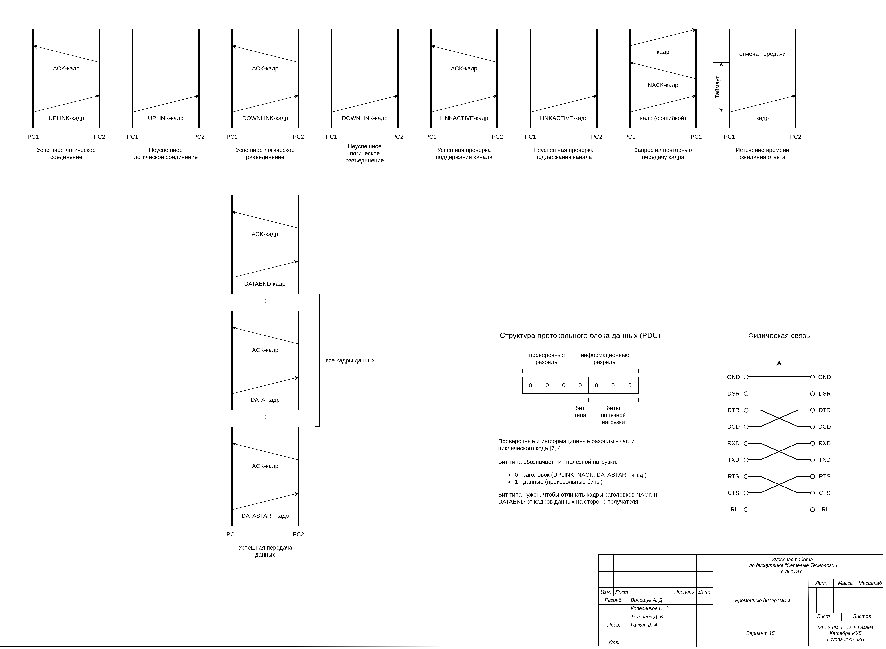
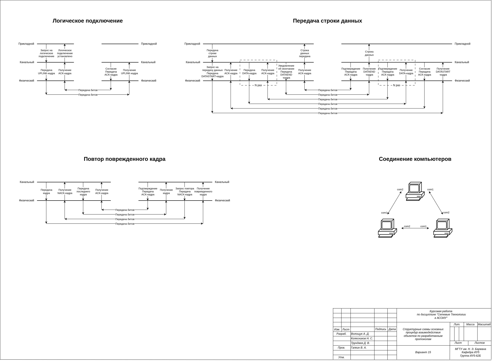
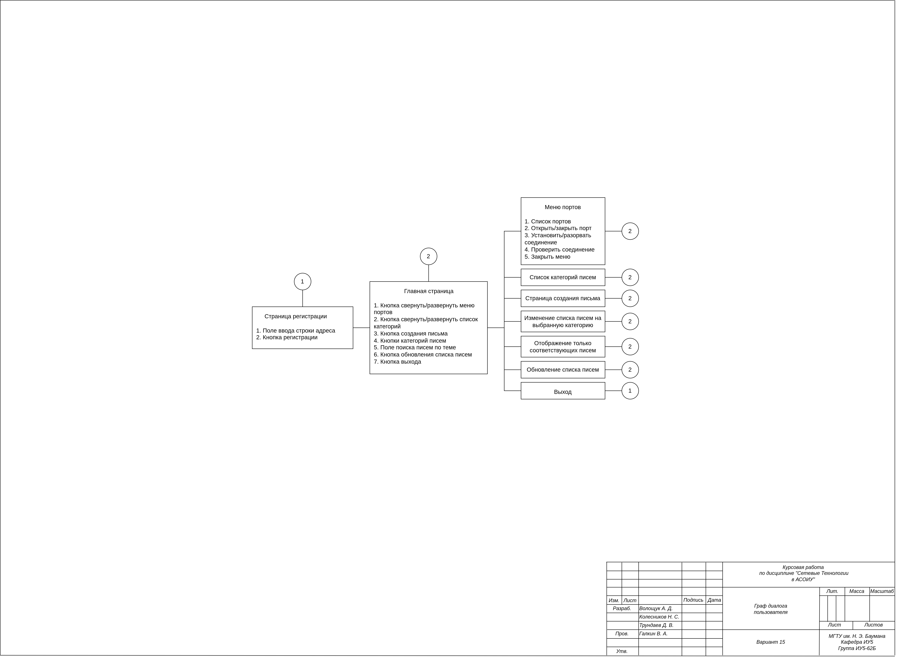

# Бэкенд курсовой работы по СТ АСОИУ

## Описание

Данный проект симулирует кольцевую компьютерную сеть электронной почты.

## Функционал

- подключение/отключение входных/выходных портов каждого ПК на физическом/канальном уровне
- подключение/отключение ПК от почтовой сети с произвольным почтовым адресом
- отправка/ответ/пересылка письма одному адресу/всем адресам
- сохранение/загрузка состояния ПК в json-файл

## Устройство

Симуляция разбита на 3 уровня: физический (RS232, DB9), канальный и прикладной.

Внешний интерфейс - REST API.

## Запуск

### Проект

```bash
python -m venv ./venv
source ./venv/bin/activate
pip install -r requirements.txt
python -m src.main
```

### Тесты

```bash
python -m unittest src.tests.test_physical src.tests.test_data_link src.tests.test_application
```

### Профилирование

```bash
python -m src.tests.profile
```

## Документация

Исходные файлы drawio в docs.

### Структура слоев



### Протокол физического слоя



### Протокол канального слоя



### Взаимодействие слоев



### Алгоритмы


### Граф диалога пользователя


